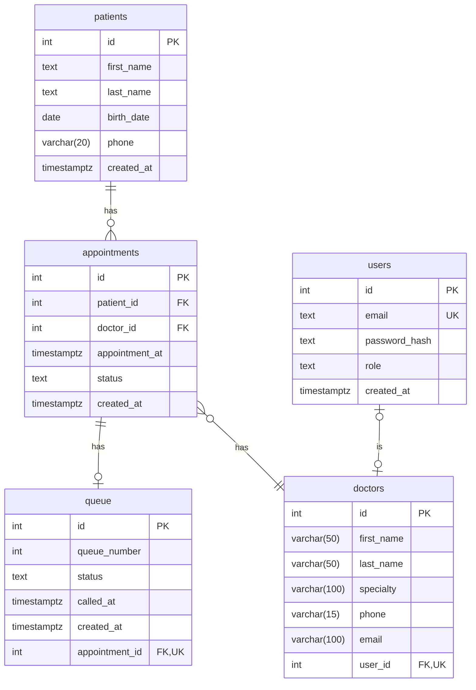

# ER Diagram

```mermaid
erDiagram
patients ||--o{ appointments : "has"
users |o--o| doctors: "is"
appointments ||--o| queue: "has"
appointments }o--|| doctors: "has"

    patients {
        int id PK
        text first_name
        text last_name
        date birth_date
        varchar(20) phone
        timestamptz created_at
    }
    appointments {
        int id PK
        int patient_id FK
        int doctor_id FK
        timestamptz appointment_at
        text status
        timestamptz created_at
    }
    doctors {
        int id PK
        varchar(50) first_name
        varchar(50) last_name
        varchar(100) specialty
        varchar(15) phone
        varchar(100) email
        int user_id FK, UK
    }
    users {
        int id PK
        text email UK
        text password_hash
        text role
        timestamptz created_at
    }
    queue{
        int id PK
        int queue_number
        text status
        timestamptz called_at
        timestamptz created_at
        int appointment_id FK,UK
    }
```
